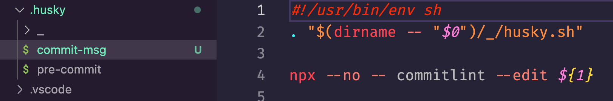

大家好, 我又来了, 书接上回, 在上一篇[Husky 和 Lint-staged 入门指南：Git 提交时自动进行代码校验和格式化](./husky+lint-staged.md)中描写了`git`提交代码时, 对暂存区的文件进行`lint`, 此篇将完成`git`提交时自动对提交`message`进行校验, 并使用`cz`帮助强制规范提交`message`

> Lint commit messages


`commitlint` 是一个用于检查 `git` 提交的 `message` 是否符合项目的规范的工具。规范的提交内容可以直接从 提交内容 生成 `changelog`

## 安装`commitlint`

```bash
pnpm add @commitlint/cli @commitlint/config-conventional -D
# or
npm install @commitlint/cli @commitlint/config-conventional -D
```

### 配置

项目根目录下创建配置文件

```bash
# Create commitlint.config.js file
touch commitlint.config.js
```

写入以下配置

```js
// commitlint.config.js
module.exports = {
  extends: ["@commitlint/config-conventional"],
};
```

### 测试

以下是一个错误例子

```bash
# Lint from stdin
echo 'foo: bar' | node_modules/.bin/commitlint
⧗   input: foo: bar
✖   type must be one of [build, chore, ci, docs, feat, fix, perf, refactor, revert, style, test] [type-enum]

✖   found 1 problems, 0 warnings
ⓘ   Get help: https://github.com/conventional-changelog/commitlint/#what-is-commitlint
```

[参考资料](https://github.com/conventional-changelog/commitlint/#what-is-commitlint)

基于以上配置下面是一个正确的例子

```bash
# Lint from stdin
echo 'fix: 解决了xxx问题' | node_modules/.bin/commitlint

```

没有报错, 通过校验

> 管道符`|`后`node_modules/.bin/commitlint` 这个写法是因为我把`commitlint`安装在本地`devDependencies`中了, 如果是全局安装的, 管道符`|`后直接`commitlint`就可以了

> 注意: 冒号是英文冒号 `:`, 冒号前边是`type`, 必须是`[build, chore, ci, docs, feat, fix, perf, refactor, revert, style, test]`这些中的一个, 然后冒号后边空一格在写上本次提交的具体`message`内容

## `git`提交代码自动校验

为了充分利用`commitlint`，我们需要实现它的自动化。下面是如何通过`git`钩子来实现, 上一篇[Husky 和 Lint-staged 入门指南：Git 提交时自动进行代码校验和格式化](./husky+lint-staged.md)中我们已经安装了`husky`, 这里不在重复安装了, 直接添加`git`钩子

```bash
npx husky add .husky/commit-msg 'npx --no -- commitlint --edit ${1}'
# or
pnpm dlx husky add .husky/commit-msg 'npx --no -- commitlint --edit ${1}'
.../Library/pnpm/store/v3/tmp/dlx-46892  |   +1 +
.../Library/pnpm/store/v3/tmp/dlx-46892  | Progress: resolved 1, reused 1, downloaded 0, added 1, done
husky - created .husky/commit-msg
```

执行成功后会在根目录`.husky`文件夹中增加一个`commit-msg`钩子文件, 内容如下:



[本地设置指南参考资料](https://commitlint.js.org/#/./guides-local-setup?id=guide-local-setup)

### 测试`hook`

您可以通过简单的提交来测试钩子。下面是一个提交`message`不规范的例子, 如果钩子生效，你应该看到这样的东西。

```bash
git commit -m 'foo: this will fail'
.../Library/pnpm/store/v3/tmp/dlx-48632  |  +74 +++++++
.../Library/pnpm/store/v3/tmp/dlx-48632  | Progress: resolved 74, reused 74, downloaded 0, added 74, done
✔ Preparing lint-staged...
✔ Running tasks for staged files...
✔ Applying modifications from tasks...
✔ Cleaning up temporary files...
⧗   input: foo: this will fail
✖   type must be one of [build, chore, ci, docs, feat, fix, perf, refactor, revert, style, test] [type-enum]

✖   found 1 problems, 0 warnings
ⓘ   Get help: https://github.com/conventional-changelog/commitlint/#what-is-commitlint

husky - commit-msg hook exited with code 1 (error)
```

下面是一个提交`message`符合规范的例子, 自从 `v8.0.0` 版本以后，如果提交`message`没有问题，`commitlint` 将不会输出任何内容。
（您可以使用`--verbose` 标志来获得详细输出）

```bash
git commit -m 'chore: 增加commitlint自动校验提交message'
.../Library/pnpm/store/v3/tmp/dlx-48930  |  +74 +++++++
.../Library/pnpm/store/v3/tmp/dlx-48930  | Progress: resolved 74, reused 74, downloaded 0, added 74, done
✔ Preparing lint-staged...
✔ Running tasks for staged files...
✔ Applying modifications from tasks...
✔ Cleaning up temporary files...
[eslint-blog ca2908a] chore: 增加commitlint自动校验提交message
 4 files changed, 834 insertions(+), 10 deletions(-)
 create mode 100755 .husky/commit-msg
 create mode 100644 commitlint.config.js
```

## 安装`commitizen`

这个工具是用来帮助我们`git`提交时写出规范的提交`message`的

**`commitizen`安装为项目开发环境依赖**

```bash
pnpm add commitizen -D
# or
npm install commitizen -D
```

**通过以下命令以使用`cz-conventional-changelog`**

```bash
# npm
node_modules/.bin/commitizen init cz-conventional-changelog --save-dev --save-exact

# pnpm
node_modules/.bin/commitizen init cz-conventional-changelog --pnpm --save-dev --save-exact
```

以上命令做了`3`件事:

1. 安装`cz-conventional-changelog`依赖包
2. 保存依赖包版本到`package.json`文件的`devDependencies`
3. 添加`the config.commitizen key`到`package.json`文件中, 内容如下:

```json
// package.json
{
  // ...
  "config": {
    "commitizen": {
      "path": "./node_modules/cz-conventional-changelog"
    }
  }
}
```

[查看更多](https://github.com/commitizen/cz-conventional-changelog)

由于我们的`commitizen`安装在本地开发环境, 所以全局环境中并没有`cz`命令, 我们在`package.json`文件的`scripts`中增加一条脚本命令:

```json
{
  "scripts": {
    "commit": "cz"
  }
}
```

然后我们就可以在终端使用`pnpm commit`或`npm run commit`来使用`cz`了, 当然如果您觉得这样的使用方式比较麻烦, 可以把`commitizen`安装到全局环境, 就可以直接在终端中使用`cz`命令了.

> 安装在开发环境是为了保证开发团队成员拉取代码后, 只需要执行一个`pnpm install`就可以达到一切正常运行的目标, 因为`package.json`中保存了全部的依赖和配置

**下面我们来测试一下**

随便修改一个文件, 然后将文件`git add`到暂存区, 执行`pnpm commit`看看效果如何

```bash
pnpm commit

> cz

cz-cli@4.3.0, cz-conventional-changelog@3.3.0

? Select the type of change that you're committing:
  test:     Adding missing tests or correcting existing tests
  build:    Changes that affect the build system or external dependencies (example scopes: gulp, broccoli, npm)
  ci:       Changes to our CI configuration files and scripts (example scopes: Travis, Circle, BrowserStack, SauceLabs)
❯ chore:    Other changes that don't modify src or test files
  revert:   Reverts a previous commit
  feat:     A new feature
  fix:      A bug fix
(Move up and down to reveal more choices)

```

使用上下方向键选择一个`type`, 回车确认, 下一步是填写这次代码变更影响的范围

```bash
? What is the scope of this change (e.g. component or file name): (press enter to skip)
```

如果不想写您也可以回车跳过, 下一步是写这次代码变更的一个简短的描述, 这将会是你`git`仓库的`commit`记录, 这个必须写

```bash
? Write a short, imperative tense description of the change (max 93 chars):
```

下一步是一个详细的描述, 如果您不想写, 这个可以回车跳过,

```bash
? Provide a longer description of the change: (press enter to skip)
```

下一步询问是否有破坏性变更, 直接回车是 `N`(没有), 如果有输入`y`在回车

```bash
? Are there any breaking changes? (y/N)
```

下一步询问这次变更是否影响到一些`open`状态的问题, 同样的, 如果没有直接回车, 如果有输入`y`在回车

```bash
? Does this change affect any open issues? (y/N)
```

因为我全都选了`No`, 这就完事了

```bash
pnpm commit

> cz

cz-cli@4.3.0, cz-conventional-changelog@3.3.0

? Select the type of change that you're committing: chore:    Other changes that don't modify src or test files
? What is the scope of this change (e.g. component or file name): (press enter to skip)
? Write a short, imperative tense description of the change (max 93 chars):
 (22) 添加cz帮助规范填写git提交message
? Provide a longer description of the change: (press enter to skip)

? Are there any breaking changes? No
? Does this change affect any open issues? No
.../Library/pnpm/store/v3/tmp/dlx-54174  |  +74 +++++++
.../Library/pnpm/store/v3/tmp/dlx-54174  | Progress: resolved 74, reused 74, downloaded 0, added 74, done
→ No staged files match any configured task.
[eslint-blog 83aca99] chore: 添加cz帮助规范填写git提交message
 2 files changed, 326 insertions(+), 2 deletions(-)
```

以上, 我们就完成 `commitizen` 规范填写 `git` 提交 `message`, 触发 `git hook` 自动校验提交的`message`

## `release-it`自动生成`changelog`

`release-it` 是一个命令行工具，用于在发布新版本时自动化处理一系列任务。它可以帮助您自动化执行以下任务：

- 增加版本号并提交 `Git`
- 生成变更日志（`Changelog`）并提交到 `Git`
- 创建 `Git` 标签并推送到远程仓库
- 发布到 `npm` 等软件仓库
- 在 `GitHub、GitLab` 等平台创建发行版

以下是如何使用 `release-it` 进行自动化版本发布的步骤：

**安装 `release-it`和`changelog`插件**

```bash
pnpm add release-it @release-it/conventional-changelog -D
# or
npm install release-it @release-it/conventional-changelog -D
```

**配置`release-it`**

在项目根目录下创建一个名为 `.release-it.json`的文件，并配置需要执行的任务：

```json
// .release-it.json
{
  "plugins": {
    "@release-it/conventional-changelog": {
      "preset": "angular"
    }
  },
  "git": {
    "commitMessage": "chore: Release v${version}"
  },
  "github": {
    "release": true,
    "draft": false
  },
  "npm": {
    "publish": true
  }
}
```

上面的配置说明：

- `git`：配置 `Git` 相关的任务，如自动提交代码、打标签等
- `github`：配置 `GitHub` 相关的任务，如创建发行版
- `npm`：配置 `npm` 相关的任务，如发布到 `npm` 仓库
- `plugins`：配置使用的插件，使用`@release-it/conventional-changelog`插件来生成 `changelog`，并使用`angular`预设

**运行 `release-it`**

在`package.json`的`scripts`属性中增加脚本命令:

```json
{
  "scripts": {
    "release": "release-it"
  }
}
```

运行以下命令：

```bash
pnpm release
```

> 注意: 运行`pnpm release`时, 工作目录必须是干净的, 也就是说你需要把修改了的文件提交, 或者使用`git stash`放入缓存中, 运行完了, 别忘了在`git stash pop`取出来

下面是我没提交修改的文件报的错:

```bash
pnpm release

> release-it

ERROR Working dir must be clean.
Please stage and commit your changes.
Documentation: https://git.io/release-it-git
```

[release-it 参考资料](https://git.io/release-it-git)

**`npm`版本号**

先补充一下`npm`版本号相关知识，`npm`的版本号遵循`SemVer` 规范，版本号格式必须采用`X.Y.Z`的格式，其中 `X`、`Y` 和 `Z` 为非负的整数。`X` 是主版本号、`Y` 是次版本号、而 `Z` 为修订号，英文对应表示为 `major`、`minor`、`patch`，每个号必须采用递增。

例如 🌰:

```
X.Y.Z => {major}.{minor}.{patch}
0.0.1
```

差不多这些就够我用了

想了解更多的朋友请查看这里[`SemVer`规范](https://semver.org/lang/zh-CN/)

```bash
# 更新主版本号
pnpm release major

# 更新次版本号
pnpm release minor

# 更新修订号
pnpm release patch
```

执行过程如下:

```bash
pnpm release patch

> release-it "patch"

WARNING The recommended bump is "minor", but is overridden with "patch".

🚀 Let's release sounding (0.0.1...0.0.2)


Changelog:
## 0.0.2 (2023-04-05)

### Bug Fixes
* 单词拼写错误 ([e809049](http://xxx.github.com/code/my-project/commit/e8090496895ade0b6b294234ab50cc6a0a085e66))

### Features
* 新增xxx功能 ([5f09f7e](http://xxx.github.com/code/my-project/commit/5f09f7ecb2b93d94a64757630bf9d6bc9f2567f1))
* 新增xxx详情页 ([c2812f9](http://xxx.github.com/code/my-project/commit/c2812f9bfc325c765b3f14ed444d0db6c997c66f))

✔ echo 更新版本成功

Changeset:
 M package.json

? Commit (chore: release v0.0.2)? Yes
? Tag (0.0.2)? Yes
? Push? Yes
🏁 Done (in 38s.)
```

`release-it`会自动执行配置的任务，更新版本号码和变更日志的描述。完成后，它会自动提交代码(`Commit`)、打标签(`Tag`)、推送(`Push`)到仓库等等。

查看 `changelog`: 生成的 `changelog` 将会保存在 `CHANGELOG.md` 文件中。你可以查看这个文件来了解新版本的变化。

[点击查看`release-it`参考资料](https://github.com/release-it/release-it/blob/main/README.md)

## 总结

- 统一的 `commit message` 格式：通过使用 `commitlint` 和 `commitizen`，我们可以定义并统一团队成员的`commit message` 格式，从而使提交历史记录更加清晰、易读和易于维护。这有助于开发者更好地了解代码的变更，追溯问题来源以及进行版本回滚等操作。

- 自动化的 `Git` 提交流程：通过使用 `husky`，我们可以定义在 `Git` 提交前自动运行的脚本。这使得我们可以在代码提交之前执行各种自动化任务，例如运行测试、格式化代码、静态代码分析等等。这有助于提高代码质量和开发效率。

- 自动生成 `Changelog`：通过使用 `commitlint` 和 `release-it`，我们可以自动生成 `Changelog`，从而方便地了解每个版本的变更和修复。这使得代码版本历史记录更加清晰、易读和易于维护。

- 自动化版本发布：通过使用 `release-it`，我们可以自动化执行一系列任务，例如增加版本号、生成变更日志、打标签、发布到 `npm` 等仓库、创建发行版等等。这使得版本发布过程更加轻松和自动化，同时也有助于确保每个版本都包含所需的变更日志和 `Git` 提交信息。

总之，使用 `commitlint, commitizen, husky, release-it` 可以帮助团队成员更好地管理代码提交、生成更好的版本历史记录以及更轻松地进行版本发布。这将有助于提高代码质量、开发效率和版本控制的可维护性。
