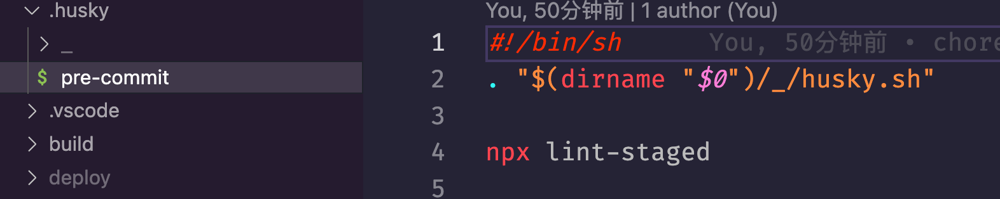

大家好, 在上一篇[Vue3+Vite 项目，如何配置 ESLint 和 Prettier 实现代码规范化？](./vite+vue3+eslint+prettier.md)中描写了如何给我们的`Vite`+`Vue3`项目配置`ESLint`和`Prettier`, 此篇我们将记录`husky`和`lint-staged`实现`git`提交代码时对项目代码进行检查与格式化.

## 安装 `husky` 和 `lint-staged`

用例：当您想使用其他代码质量工具和 `Prettier`（例如 `ESLint`、`Styleint` 等）时，或者如果您需要对部分暂存文件进行检查时（`git add --patch`），这很有用。

在继续操作之前，请确保 `Prettier` 已安装并位于 `devDependencies` 中。

```bash
pnpm dlx mrm lint-staged
# or
npx mrm lint-staged
```

这将安装`husky`和`lint-staged`，然后向项目的`package.json`添加一个配置，该配置将在`pre-commit hook` 中自动检查并格式化支持的文件。

在[lint-staged](https://github.com/okonet/lint-staged#configuration)`repo` 中阅读更多信息。

**下面是我的操作过程**

```bash
pnpm dlx mrm lint-staged
.../Library/pnpm/store/v3/tmp/dlx-82832  | +266 +++++++++++++++++++++++++++
.../Library/pnpm/store/v3/tmp/dlx-82832  | Progress: resolved 266, reused 227, downloaded 39, added 266, done
Running lint-staged...
Update package.json
Installing lint-staged and husky...
Packages: +45
+++++++++++++++++++++++++++++++++++++++++++++
Progress: resolved 948, reused 907, downloaded 0, added 45, done

devDependencies:
+ husky 8.0.3
+ lint-staged 13.2.0

Done in 12.6s
husky - Git hooks installed
husky - created .husky/pre-commit
```

**让我们来看一下`package.json`中都发生了什么**

```json
// package.json
{
  "scripts": {
    "prepare": "husky install"
  },
  "devDependencies": {
    "husky": ">=7",
    "lint-staged": ">=10"
  },
  "lint-staged": {
    // 带着 --cache 执行代码检查后会在项目根目录自动生成一个 .eslintcache 文件
    "*.{vue,js,jsx,ts,tsx}": "eslint --cache --fix"
  }
}
```

**让我们来看看 `--cache` 是干什么的?**

存储有关已处理文件的信息，以便仅对已更改的文件进行操作。启用此选项可以确保只对更改后的文件进行检查，从而显著提高 `ESLint` 的运行时性能。默认情况下，缓存存储在`.eslintcache` 中。

这个文件里边缓存了被检查文件的本地绝对路径, 那么我们每个开发人员执行`lint-staged`或`git`提交后生成的`.eslintcache`里边的路径应该都是不一样的, 我猜可能会出现冲突, 所以建议把这个文件加到`.gitignore`中忽略掉, 或者也可以选择不使用`--cache`, 当不使用`--cache`进行检查时, `.eslintcache`文件会被自动删掉, 如需了解更多可以查看下面的参考资料

[`--cache` 参考资料](https://eslint.org/docs/latest/use/command-line-interface#--cache)

同时, 在我们的项目根目录增加了一个`.husky`文件夹, 里边是这样的



> 注意: 这个执行命令自动生成的, 手动创建的好像不好使, 不过可以自己修改生成后的文件里边的命令, 比如我们用的`pnpm`包管理器, 就可以修改`npx lint-staged`为`pnpm dlx lint-staged`

## 总结

一行命令搞定(推荐)👍🏻

下一篇[使用 commitlint、cz 和 husky 校验 Git 提交信息并生成 CHANGELOG](./commitlint+cz.md), 将带来`commitlint`检查`git`提交`message`, 使用`cz-conventional-changelog`帮助强制开发者规范`git`提交`message`, `release-it`自动更新版本号并且自动生成`CHANGELOG.md`
