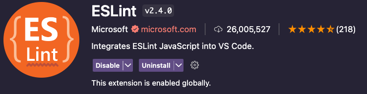
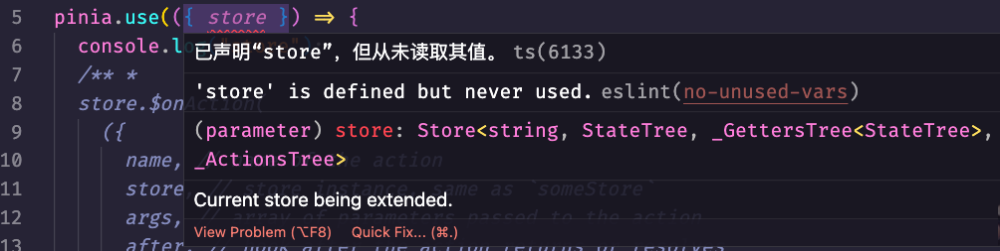
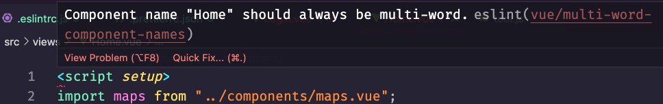

## 项目介绍

---

本文记录了最近在`Vite`+`Vue3`搭建的`JavaScript`项目中配置`ESLint`和`Prettier`来检查代码风格和格式化代码的经验，该项目使用的包管理器是`pnpm`，使用其他工具的朋友自己修改文中`pnpm`相关的安装命令，下一篇记录为该项目添加`husky`+`lint-staged`来实现`git`提交时对代码进行检查和格式化。

项目结构很简单：

- public
- src
- index.html
- .env
- .gitignore
- package.json
- vite.config.js
- uno.config.js
- postcss.config.js

所以下面我将配置`ESLint`+`Prettier`来检查`src`目录中的所有文件中的代码。

## ESLint

---

### `ESLint`入门

`ESLint` 是一个用于检测 `ECMAScript`/`JavaScript` 代码中的潜在问题和错误的工具，旨在使代码更一致并避免错误。它可以帮助开发者检测代码中的潜在问题，提高代码质量。

`ESLint` 是完全可插拔的。每一条规则都是一个插件，您可以在运行时添加更多。您还可以添加社区插件、配置和解析器来扩展 `ESLint` 的功能。

### 先决条件

要使用`ESLint`，必须安装`Node.js`（`^12.22.0、^14.17.0 或>=16.0.0`）并构建`SSL`支持。（如果您使用的是官方的`Node.js`发行版，则始终内置`SSL`。）

### 安装 ESLint

- 方式一 (快速开始)

你可以使用以下命令安装和配置 `ESLint` :

```zsh
pnpm create @eslint/config
# or
npm init @eslint/config
```

> 注意：运行以上命令是假设您已经有了一个`package.json`文件。如果没有，请确保事先运行`pnpm init`、`npm init`或`yarn init`。

按照提示步骤一步一步选择, 回车即可:

使用`ESLint`做什么? 我选择第三个, 检查语法, 发现问题, 强制代码风格

```zsh
? How would you like to use ESLint? …
  To check syntax only
  To check syntax and find problems
❯ To check syntax, find problems, and enforce code style
```

项目模块类型? 我的项目使用的 `import/export` 选择第一个

```zsh
? What type of modules does your project use? …
❯ JavaScript modules (import/export)
  CommonJS (require/exports)
  None of these
```

项目用的啥框架? 我用`Vue.js`

```zsh
? Which framework does your project use? …
  React
❯ Vue.js
  None of these
```

项目中使用 `TypeScript`? 是的选择 `Yes`，我不是 `TypeScript` 选择 `No`

```zsh
? Does your project use TypeScript? › No / Yes
```

代码运行环境? 我在项目中使用了 `node` 中的 `process`, 全选上

```zsh
? Where does your code run? …  (Press <space> to select, <a> to toggle all, <i> to invert selection)
✔ Browser
✔ Node
```

选择代码风格? 我看了一下 `popular style`，里边没有 `prettier` ，想用 `prettier` 检查并格式化代码, 我建议使用回答问题来自定义代码风格

```zsh
? How would you like to define a style for your project? …
  Use a popular style guide
❯ Answer questions about your style
```

`ESLint` 的配置文件格式? 我选择 `JavaScript`, 理由是可以在 `js` 文件中写条件判断语句来根据开发或生产环境开关 `ESLint` 规则

```zsh
? What format do you want your config file to be in? …
❯ JavaScript
  YAML
  JSON
```

用啥缩进? 我选择`Spaces` , 默认它是`4`个空格，我们喜欢用`2`个空格, 后边生成的配置中我手动给改成`2`个空格

```zsh
? What style of indentation do you use? …
  Tabs
❯ Spaces
```

字符串使用双引号还是单引号? 我们项目的小伙伴儿想用双引号, 选择`Double`

```zsh
? What quotes do you use for strings? …
❯ Double
  Single
```

用哪种结束符? `Windows`是`CRLF`, `Unix`是`LF`, 我选`Unix`

```zsh
? What line endings do you use? …
❯ Unix
  Windows
```

用分号吗? 我们习惯使用分号`;`，选择 `Yes` ，不喜欢写分号的朋友，请选择 `No`

```zsh
? Do you require semicolons? › No / Yes
```

检查到我没有安装`ESLint`, 是否马上安装? 安装 `eslint` 和 `eslint-plugin-vue`, 选择 `Yes`

```zsh
Local ESLint installation not found.
The config that you've selected requires the following dependencies:

eslint-plugin-vue@latest eslint@latest
? Would you like to install them now? › No / Yes
```

选择您使用的包管理器? 我是 `pnpm`

```zsh
? Which package manager do you want to use? …
  npm
  yarn
❯ pnpm
```

回车确认, 开始安装...

```zsh
✔ How would you like to use ESLint? · style
✔ What type of modules does your project use? · esm
✔ Which framework does your project use? · vue
✔ Does your project use TypeScript? · No / Yes
✔ Where does your code run? · browser, node
✔ How would you like to define a style for your project? · prompt
✔ What format do you want your config file to be in? · JavaScript
✔ What style of indentation do you use? · 4
✔ What quotes do you use for strings? · double
✔ What line endings do you use? · unix
✔ Do you require semicolons? · No / Yes
Local ESLint installation not found.
The config that you've selected requires the following dependencies:

eslint-plugin-vue@latest eslint@latest
✔ Would you like to install them now? · No / Yes
✔ Which package manager do you want to use? · pnpm
Installing eslint-plugin-vue@latest, eslint@latest
...
...
Done in 27.9s
Successfully created .eslintrc.js file in /code/vite-vue3-project
```

在项目的 `package.json` 文件中查看 `devDependencies`增加了 `eslint` 和 `eslint-plugin-vue`
在项目根目录生成了`.eslintrc.js` 配置文件，打开文件找到 `rules` 把 `indent` 规则里边的 `4` 改成 `2`, 代码缩进就是 `2` 个空格了

在运行以上命令之后，您的目录中会有一个`.eslintrc.{js，yml，json}`文件。我选择使用的是`JavaScript`文件, 我的文件内容是这样的:

```js
module.exports = {
  env: {
    browser: true,
    es2021: true,
    node: true,
  },
  extends: ["eslint:recommended", "plugin:vue/vue3-essential"],
  overrides: [],
  parserOptions: {
    ecmaVersion: "latest",
    sourceType: "module",
  },
  plugins: ["vue"],
  rules: {
    indent: ["error", 2],
    "linebreak-style": ["error", "unix"],
    quotes: ["error", "double"],
    semi: ["error", "always"],
  },
};
```

- 方式二 (手动设置)

您也可以在项目中手动设置`ESLint`。

> 注意: 在开始之前，您必须已经有一个`package.json`文件。如果没有，请确保预先运行`pnpm init`, `npm init`或`yarn init`来创建文件。

1. 使用以下命令手动安装`ESLint` 和 `Vue`插件

```zsh
pnpm add eslint@latest eslint-plugin-vue@latest -D
# or
npm install eslint@latest eslint-plugin-vue@latest -D
```

2. 项目根目录中添加一个`.eslintrc.js`配置文件

```zsh
# Create JavaScript configuration file
touch .eslintrc.js
```

3. 在编辑器中打开`.eslintrc.js`配置文件进行自定义配置, [Configure ESLint documentation](https://eslint.org/docs/latest/use/configure/):

```js
// .eslintrc.js
module.exports = {
  env: {
    browser: true,
    es2021: true,
    node: true,
  },
  extends: ["eslint:recommended", "plugin:vue/vue3-essential"],
  overrides: [],
  parserOptions: {
    ecmaVersion: "latest",
    sourceType: "module",
  },
  plugins: ["vue"],
  rules: {
    indent: ["error", 2],
    "linebreak-style": ["error", "unix"],
    quotes: ["error", "double"],
    semi: ["error", "always"],
  },
};
```

以上步骤完成 ESLint 就安装上了

然后在项目根目录添加`.eslintignore`文件, 忽略不想让`ESLint`检查的文件夹和文件

```zsh
touch .eslintignore
```

想忽略的全往里边列就行了, 举个例子 🌰:

```zsh
*.sh
*.md
*.woff
*.ttf
*.yaml
.vscode
.idea
node_modules
dist
public
docs
.husky
.eslintrc.js

# Allowlist 'test.js' in the '.build' folder
# But do not allow anything else in the '.build' folder to be linted
!.build
.build/*
!.build/test.js

```

如需最新资讯请参考[`ESLint`官网](https://eslint.org/)

### `VS Code`安装`ESLint`

打开`VS Code`, 在`Extensions`中搜索`ESLint`, 找到之后点击`install`, 启用`ESLint`后会寻找到项目根目录下的`.eslintrc.js`配置文件, 根据里边的规则对项目代码进行检查



打开一个文件看看效果, 我这里有一个变量声明了却没有读取使用它, `ESLint`已经在编辑器中报出了红色波浪线, 证明配置已经生效了



## Prettier

---

### Prettier 入门

- `Prettier`是什么?
  - 一个“有态度”的代码格式化工具
  - 支持大量编程语言
  - 已集成到大多数编辑器中
  - 几乎不需要设置参数
- 为什么使用`Prettier`?
  - 按保存键时，代码就被格式化了
  - 代码评审时无须争论代码样式
  - 节省时间和精力

### 安装 Prettier

首先,在本地安装`Prettier`

```zsh
pnpm add prettier@latest -D
# or
npm install prettier@latest -D
```

然后，创建一个空的配置文件，让编辑器和其他工具知道您正在使用`Prettier`：

```zsh
echo {} > .prettierrc.json
```

在配置文件中增加如下内容:

```jsonc
// .prettierrc.json 根据ESLint规则配置, 后边会说怎么解决二者规则冲突的问题
{
  "useTabs": false,
  "tabWidth": 2,
  "jsxSingleQuote": false,
  "singleQuote": false,
  "endOfLine": "lf",
  "semi": true,
  "trailingComma": "es5"
}
```

(可选)接下来，创建一个`.prettierignore`文件，让`Prettier CLI`和编辑器知道不格式化哪些文件。下面是一个例子：

```sh
# Ignore artifacts:
build
coverage
```

我没有创建`.prettierignore`文件, 感觉有`.eslintignore`就够了

> 提示: 以`.gitignore` 和`.eslintignore` 为基础（如果你有）。

现在，使用`Prettier`格式化所有文件：

```zsh
npx prettier --write
```

### `VS Code`安装`Prettier`

从命令行进行格式化是一个很好的入门方法，但您可以通过键盘快捷键或在保存文件时自动从编辑器中运行 `Prettier`，从而充分利用它。当一行在编码时变得太长，以至于不适合你的屏幕时，只需按保存快捷键，就可以看到它神奇地被包裹成多行！或者，当你粘贴一些代码时，缩进会变得一团糟，让 `Prettier` 在不离开编辑器的情况下为你修复它。

打开`VS Code`, 在`Extensions`中搜索`Prettier`, 找到之后点击`install`,


在项目根目录添加`.vscode`文件夹并且新建一个`settings.json`文件

```zsh
# Create directory
mkdir .vscode
# Create settings.json file
touch .vscode/settings.json
```

配置保存时使用`Prettier`对代码进行格式化, 在`settings.json`文件中增加如下内容:

```jsonc
// settings.json
{
  "editor.defaultFormatter": "esbenp.prettier-vscode",
  "editor.formatOnSave": true,
  "editor.codeActionsOnSave": {
    "source.organizeImports": true,
    "source.fixAll": true
  }
}
```

[设置编辑器参考资料](https://www.prettier.cn/docs/editors.html)

### 配合`ESLint`使用, 解决二者规则冲突

当 `ESLint` 的规则和 `Prettier` 的规则相冲突时，就会发现一个尴尬的问题，用`Prettier`来格式化代码，`ESLint`就会报错。

与`ESLint`配合使用，请安装`eslint-config-prettier`，以使`ESLint`和`Prettier`彼此配合得很好。它关闭所有不必要的或可能与`Prettier`冲突的`ESLint`规则。具体步骤如下:

```zsh
# Install eslint-config-prettier
pnpm add eslint-config-prettier@latest -D
# or
npm install eslint-config-prettier@latest -D
```

修改`.eslintrc.js`

```js
// 在 extends 尾部加入 prettier 即可
{
  "extends": [
    "eslint:recommended",
    "plugin:vue/vue3-essential",
    "prettier"
  ]
}
```

但是以上做法只是关闭了与`Prettier`相冲突的`ESLint`的规则, 而我们的目标是要让`ESLint`使用`Prettier`的规则去检查代码语法和风格等问题, 有办法, `prettier`官方有个插件`eslint-plugin-prettier`, 使用这个插件一步简单的配置就搞定:

**`prettier`官方推荐配置方法**

1. 安装`eslint-plugin-prettier`和`eslint-config-prettier`

```zsh
pnpm add eslint-plugin-prettier@latest eslint-config-prettier@latest -D
# or
npm install eslint-plugin-prettier@latest eslint-config-prettier@latest -D
```

2. 您需要在`.eslintrc.json`中添加`plugin:prettier/recommended`作为最后一个扩展：

```js
// 在 extends 尾部增加 plugin:prettier/recommended
{
  extends: [
    "eslint:recommended",
    "plugin:vue/vue3-essential",
    "plugin:prettier/recommended"
  ],
}
```

`plugin:prettier/recommended`做了什么？额，它相当于以下配置：

```js
{
  extends: ["prettier"],
  plugins: ["prettier"],
  rules: {
    "prettier/prettier": "error",
    "arrow-body-style": "off",
    "prefer-arrow-callback": "off"
  }
}
```

[eslint-plugin-prettier 参考资料](https://github.com/prettier/eslint-plugin-prettier)

总之, 我们安装了`eslint-config-prettier`和`eslint-plugin-prettier`后, 修改一下`.eslintrc.js`就可以让`ESLint`和`Prettier`配合工作了

```js
// 在 extends 尾部增加 plugin:prettier/recommended
{
  extends: [
    "eslint:recommended",
    "plugin:vue/vue3-essential",
    "plugin:prettier/recommended"
  ],
}
```

如需最新资讯请参考[`Prettier`官网](https://prettier.io/)

**解决`SwitchCase`缩进规则冲突**

二者缩进规则不一样, 发生了冲突, 使用如下配置解决

```js
// 修改 .eslintrc.js 文件
{
  rules: {
    indent: ["error", 2, { SwitchCase: 1 }],
  }
}
```

**覆盖 `vue/multi-word-component-names` 规则**



这个规则要求组件名称要多个单词构成, 而我们当初写的时候没有注意这一点, 现在改成本太大了, 只能把这个规则给覆盖掉

```js
// .eslintrc.js 文件 overrides 部分
{
  overrides: [
    {
      files: ["src/**/*.vue"],
      rules: { "vue/multi-word-component-names": "off" },
    },
  ],
}
```

⚙️ `This rule is included in all of "plugin:vue/vue3-essential", "plugin:vue/essential", "plugin:vue/vue3-strongly-recommended", "plugin:vue/strongly-recommended", "plugin:vue/vue3-recommended" and "plugin:vue/recommended"`.

[参考资料 vue/multi-word-component-names](https://eslint.vuejs.org/rules/multi-word-component-names.html)

**关掉已声明变量未使用的检查**

```js
{
  rules: {
    "no-unused-vars": "off"
  }
}
```

## 注意事项

---

修改`prettier`配置后需要重新启动`VS Code`编辑器`ESLint`才能够正常工作

## 总结

---

最终我的配置文件:

```js
// .eslintrc.js

module.exports = {
  env: {
    browser: true,
    es2021: true,
    node: true,
  },
  extends: [
    "eslint:recommended",
    "plugin:vue/vue3-essential",
    "plugin:prettier/recommended",
  ],
  overrides: [
    {
      files: ["src/**/*.vue"],
      rules: { "vue/multi-word-component-names": "off" },
    },
  ],
  parserOptions: {
    ecmaVersion: "latest",
    sourceType: "module",
  },
  plugins: ["vue"],
  rules: {
    indent: ["error", 2, { SwitchCase: 1 }],
    "linebreak-style": ["error", "unix"],
    quotes: ["error", "double"],
    semi: ["error", "always"],
    "no-unused-vars": "off",
    // 生产模式不允许使用log
    "no-console":
      process.env.NODE_ENV === "production"
        ? ["error", { allow: ["error", "warn"] }]
        : "off",
    // 生产默认不允许使用debugger
    "no-debugger": process.env.NODE_ENV === "production" ? "warn" : "off",
  },
};
```

```jsonc
// .prettierrc.json

{
  "useTabs": false,
  "tabWidth": 2,
  "jsxSingleQuote": false,
  "singleQuote": false,
  "endOfLine": "lf",
  "semi": true,
  "trailingComma": "es5"
}
```

```json
// package.json 中新增了如下依赖包
{
  "devDependencies": {
    "eslint": "^8.37.0",
    "eslint-config-prettier": "^8.8.0",
    "eslint-plugin-prettier": "^4.2.1",
    "eslint-plugin-vue": "^9.10.0",
    "prettier": "^2.8.7"

    // ......
  }
}
```

以上实现了`ESLint`和`Prettier`配合规范代码风格, 下一篇将带来使用`git`提交代码时, 对代码进行检查并格式化
